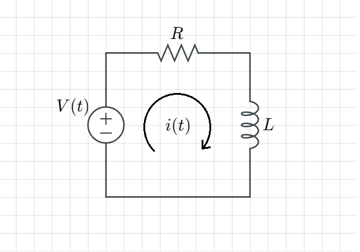
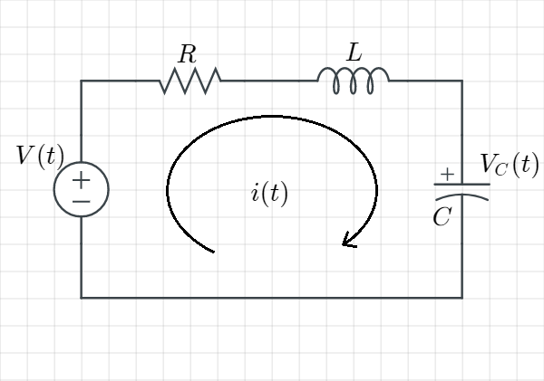
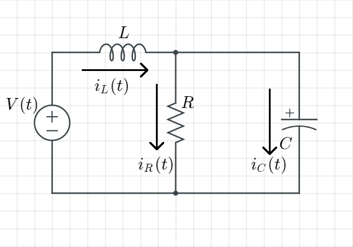

# 第三章 狀態方程式

- [第三章 狀態方程式](#第三章-狀態方程式)
  - [有兩種途徑可以用來 分析/設計 回授控制系統](#有兩種途徑可以用來-分析設計-回授控制系統)
  - [狀態空間表示法標準形式](#狀態空間表示法標準形式)
    - [Ex. 給定狀態方程式與輸出方程式](#ex-給定狀態方程式與輸出方程式)
  - [3.4 用 狀態空間 代表一個電路系統的***行為***](#34-用-狀態空間-代表一個電路系統的行為)
    - [Ex. 推導以下RL電路的***狀態空間表示法***(輸入為$v(t)$、輸出為$V_R(t)$)](#ex-推導以下rl電路的狀態空間表示法輸入為vt輸出為v_rt)
    - [Ex. 推導以下RLC電路的***狀態空間表示法***(輸入為$v(t)$、輸出為$V_L(t)$)](#ex-推導以下rlc電路的狀態空間表示法輸入為vt輸出為v_lt)
      - [Ex. 續上題，令 狀態空間 $x(t) = \left [ \begin{matrix} v_R(t) \\ v_C(t) \end{matrix} \right ]$](#ex-續上題令-狀態空間-xt--left--beginmatrix-v_rt--v_ct-endmatrix-right-)
      - [Ex. 續上題，令 狀態空間 $x(t) = \left [ \begin{matrix} q(t) \\ i(t) \end{matrix} \right ]$，(其中$q$為電量，$q(t) = Cv_C(t)$)](#ex-續上題令-狀態空間-xt--left--beginmatrix-qt--it-endmatrix-right-其中q為電量qt--cv_ct)
    - [Ex. 給定以下電路，求其狀態空間表示法，假設輸入為 $v(t)$、輸出為 $i_R(t)$](#ex-給定以下電路求其狀態空間表示法假設輸入為-vt輸出為-i_rt)
  - [3.5 將 轉移函數 轉換為 狀態空間 ***考試重點***](#35-將-轉移函數-轉換為-狀態空間-考試重點)
    - [tf $\Rightarrow$ DE](#tf-rightarrow-de)
      - [Ex. (tf)$\frac{1}{s^2 + 2s + 1}$ $\Rightarrow$ DE](#ex-tffrac1s2--2s--1-rightarrow-de)
      - [Ex. (tf)$\frac{s + 2}{s^2 + 2s +1}$ $\Rightarrow$ DE](#ex-tffracs--2s2--2s-1-rightarrow-de)
    - [DE $\Rightarrow$ ss](#de-rightarrow-ss)
      - [給定 tf：$\frac{C(s)}{R(s)} = \frac{24}{s^3 + 9s^2 + 26s + 24}$](#給定-tffraccsrs--frac24s3--9s2--26s--24)
  - [3.6 將 狀態空間 轉換為 轉移函數 ***考試重點***](#36-將-狀態空間-轉換為-轉移函數-考試重點)
  - [3.7 線性化](#37-線性化)

## 有兩種途徑可以用來 分析/設計 回授控制系統

|       |     Transfer function approach (轉移函數方法)      |        State-space approach (狀態空間方法)         |
| :---: | :------------------------------------------------: | :------------------------------------------------: |
| 描述  |                   頻域，經典做法                   |                   時域，現代方法                   |
| 優點  |           可以簡單地將互聯的子系統模型化           | 適用範圍廣闊，非線性、時變、非零初始條件都可以使用 |
| 缺點  | 適用性太侷限，只能用於線性非時變系統(或者近似於此) |                                                    |

狀態空間可分為兩個表示方程式：  

1. State equations 狀態：系統的內部訊號  
   $\frac{dx_i(t)}{dt} = f_i[x_1(t), x_2(t), ......, x_n(t), u_1(t), u_2(t), ......, u_m(t)]$  
2. Output equations  
   $y_j(t) = g_j[x_1(t), x_2(t), ......, x_n(t), u_1(t), u_2(t), ......, u_m(t)]$  

input  variables輸入變數：$u_k(t), k = 1, ..., m$  
output variables輸出變數：$y_j(t), j = 1, ..., p$  
state  variables狀態變數：$x_i(t), i = 1, ..., n$  

改寫成向量矩陣型式：  

input  vector輸入向量：$u(t) = \left [ \begin{array}{c} u_1(t) \\ . \\ . \\ . \\ u_m(t)\end{array} \right ]$  

output vector輸出向量：$y(t) = \left [ \begin{array}{c} y_1(t) \\ . \\ . \\ . \\ y_p(t)\end{array} \right ]$  

state  vector狀態向量：$x(t) = \left [ \begin{array}{c} x_1(t) \\ . \\ . \\ . \\ x_n(t)\end{array} \right ]$  

## 狀態空間表示法標準形式

State  equation: $x'(t) = Ax(t) + Bu(t)$  
Output equation:  $y(t) = Cx(t) + Du(t)$  

-------------------------------------------------------------------------------------------------------------------------------------------------------

### Ex. 給定狀態方程式與輸出方程式

>State equation:
>>$\frac{dx_1(t)}{dt} = a_{11}x_1(t) + a_{12}x_2(t) + b_{11}u(t)$  
>>$\frac{dx_2(t)}{dt} = a_{21}x_1(t) + a_{22}x_2(t) + b_{21}u(t)$  
>
>Output equation:
>>$y(t) = C_{11}x_1(t) + C_{12}x_2(t) + du(t)$  
>
>則列出矩陣為：
>>$A = \left [ \begin{matrix} a_{11} && a_{12} \\ a_{21} && a_{22} \end{matrix} \right ]$, $B = \left [ \begin{matrix} b_{11} \\ b_{21} \end{matrix} \right ]$  
>>$C = \left [ \begin{matrix} c_{11} && c_{12} \end{matrix} \right ]$, $D = d$  

-------------------------------------------------------------------------------------------------------------------------------------------------------

## 3.4 用 狀態空間 代表一個電路系統的***行為***

-------------------------------------------------------------------------------------------------------------------------------------------------------

### Ex. 推導以下RL電路的***狀態空間表示法***(輸入為$v(t)$、輸出為$V_R(t)$)

  

>用KVL寫出迴路方程式  
>>$L\frac{di}{dt} + Ri = v(t)$  
>
>把 $i(t)$ 當成狀態 $x(t)$ 並整理成  
>$\left. \begin{array}{c}x'(t) = Ax(t) + Bu(t) \\ y(t) = Cx(t) + Du(t)\end{array} \right \}$ 的型式  
>就得出此電路的狀態空間表示法  
>>狀態方程式：$\frac{di(t)}{dt} = - \frac{R}{L}i(t) + \frac{1}{L}v(t)$ --- [1]  
>>輸出方程式：$v_R(t) = Ri(t)$
>
>或者，如果把 $v_R(t)$ 當成狀態 $x(t)$  
>>>狀態方程式：$\frac{dv_R(t)}{dt} = R\frac{di(t)}{dt}$ ([1]式$\times R$) $= -\frac{R}{L}Ri(t) + \frac{R}{L}v(t)$  
>>>其中$Ri(t) = v_R(t)$  
>>>$\Rightarrow \frac{dv_R(t)}{dt} = -\frac{R}{L}v_R(t) + \frac{R}{L}v(t)$  
>>
>>>輸出方程式：$v_R(t) = v_R(t)$ (因為我們把輸出本身當作狀態)  
>>
>>得到此電路的狀態空間表示  
>>>狀態方程式：$\frac{dv_R(t)}{dt} = -\frac{R}{L}v_R(t) + \frac{R}{L}v(t)$  
>>>輸出方程式：$v_R(t) = v_R(t)$  

-------------------------------------------------------------------------------------------------------------------------------------------------------

### Ex. 推導以下RLC電路的***狀態空間表示法***(輸入為$v(t)$、輸出為$V_L(t)$)

  

>列出元件特性  
>>R: $v_R(t) = i_R(t)R$  
>>L: $v_L(t) = L\frac{di_L(t)}{dt}$  
>>C: $i_C(t) = C\frac{dv_C(t)}{dt}$  
>>
>用KVL列出一種狀態方程式  
>>把 $i(t)$ 當狀態 $x(t)$  
>>>$-v(t) + Ri(t) + L\frac{di(t)}{dt} + v_C(t) = 0$  
>>>$\Rightarrow \frac{di(t)}{dt} = -\frac{R}{L}i(t) + \frac{v(t)}{L} - \frac{v_C(t)}{L}$　　　　----state eq \[1\]  
>>
>>把 $v_C(t)$ 當狀態 $x(t)$  
>>>$\frac{dv_C(t)}{dt} = \frac{1}{C}i(t)$　　　　　　　　　　　 ----state eq \[2\]  
>>
>輸出方程式  
>>$v_L(t) = L\frac{di_L(t)}{dt} = L\frac{di(t)}{dt} = -Ri(t) - v_C(t) + v(t)$  
>
>令狀態空間state為$x(t) = \left [ \begin{matrix} i(t) \\ v_C(t) \end{matrix} \right ]$，則可以列式  
>>狀態方程式：$\left [ \begin{matrix} \frac{di(t)}{dt} \\ \frac{dv_C(t)}{dt} \end{matrix} \right ] = \left [ \begin{matrix} -\frac{R}{L} && -\frac{1}{L} \\ \frac{1}{C} && 0  \end{matrix} \right ]\left [ \begin{matrix} i(t) \\ v_C(t)  \end{matrix} \right ] + \left [ \begin{matrix} \frac{1}{L} \\ 0 \end{matrix} \right ]v(t)$  
>>輸出方程式：$v_L(t) = \left [ \begin{matrix} v_L(t) \end{matrix} \right ] = \left [ \begin{matrix} -R \\ -1 \end{matrix} \right ]\left [ \begin{matrix} i(t) \\ v_C(t) \end{matrix} \right ] + \left [ \begin{matrix} 1 \end{matrix} \right ]v(t)$  

-------------------------------------------------------------------------------------------------------------------------------------------------------

#### Ex. 續上題，令 狀態空間 $x(t) = \left [ \begin{matrix} v_R(t) \\ v_C(t) \end{matrix} \right ]$

-------------------------------------------------------------------------------------------------------------------------------------------------------

#### Ex. 續上題，令 狀態空間 $x(t) = \left [ \begin{matrix} q(t) \\ i(t) \end{matrix} \right ]$，(其中$q$為電量，$q(t) = Cv_C(t)$)

***Rule：對RLC電路來說，可以選擇電容跨壓$v_C(t)$ 與 電感電流 $i_L(t)$ 作為狀態變數***  

-------------------------------------------------------------------------------------------------------------------------------------------------------

### Ex. 給定以下電路，求其狀態空間表示法，假設輸入為 $v(t)$、輸出為 $i_R(t)$

  

>選擇狀態空間 $x(t) = \left [ \begin{matrix} v_C(t) \\ i_L(t) \end{matrix} \right ]$  
>並整理成狀態空間表示式的型式$\begin{array}{c} x'(t) = Ax(t) + Bv(t) \\ i_R(t) = Cx(t) + Dv(t) \end{array}$  
>1. 列出元件特性
>>  Ｒ：$v_R(t) = i_R(t)R$、Ｌ：$v_L(t) = L\frac{di_L(t)}{dt}$、Ｃ：$i_C(t) = C\frac{dv_C(t)}{dt}$  
>
>2. KCL/KVL列式  
>>KCL：
>>>$i_L(t) = i_R(t) + i_C(t) = \frac{v_C(t)}{R} + C\frac{dv_C(t)}{dt}$  
>>>$\Rightarrow \frac{dv_C(t)}{dt} = -\frac{1}{RC}v_C(t) + \frac{1}{C}i_L(t)$　　　　　　　　　---state eq (1)  
>>
>>KVL：
>>>$-v(t) + v_L(t) + v_C(t) = 0$  
>>>$\Rightarrow -v(t) + L\frac{di_L(t)}{dt} + v_C(t) = 0$  
>>>$\frac{di_L(t)}{dt} = -\frac{1}{L}v_C(t) + \frac{1}{L}v(t)$　　　　　　　　　　　 ---state eq (2)  
>
>3. 列輸出方程式  
>>$i_R(t) = \frac{v_C(t)}{R}$  
>
>然後就可以列出向量矩陣的型式
>>狀態方程式：$\left [ \begin{matrix} \frac{dv_C(t)}{dt} \\ \frac{d_i(t)}{dt} \end{matrix} \right ] = \left [ \begin{matrix} -\frac{1}{RC} && \frac{1}{C} \\ -\frac{1}{L} && 0 \end{matrix} \right ]\left [ \begin{matrix} v_C(t) \\ i_L(t) \end{matrix} \right ] + \left [ \begin{matrix} 0 \\ \frac{1}{L} \end{matrix} \right ]v(t)$  
>>輸出方程式：$i_R(t) = \left [ \begin{matrix} \frac{1}{R} && 0 \end{matrix} \right ]\left [ \begin{matrix} v_C(t) \\ i_L(t) \end{matrix} \right ]$  

accessible(measurable)可計量的  

狀態不一定是可計量的，但在線性RLC電路中的狀態都是可計量的  
輸出***必須***是可計量的  

## 3.5 將 轉移函數 轉換為 狀態空間 ***考試重點***

狀態空間表示法 的其中一個好處是，它可以在電腦上的 物理模擬系統 中使用  

流程：  

| 轉移函數(tf)        |               | 微分方程(DE)                    |               | 狀態空間模型(ss)                                    |
| ------------------- | ------------- | ------------------------------- | ------------- | --------------------------------------------------- |
| $\frac{Y(s)}{U(s)}$ | $\Rightarrow$ | $y''(t) + 2y'(t) + y(t) = u(t)$ | $\Rightarrow$ | $x'(t) = Ax(t) + Bu(t)$ $ y(t) = Cx(t) + Du(t)$ |

### tf $\Rightarrow$ DE

-------------------------------------------------------------------------------------------------------------------------------------------------------

#### Ex. (tf)$\frac{1}{s^2 + 2s + 1}$ $\Rightarrow$ DE

>令轉移函數$\frac{Y(s)}{U(s)} = \frac{1}{s^2 + 2s + 1}$  
>移項  
>>$(s^2 + 2s + 1)Y(s) = U(s)$  
>>$s^2Y(s) + 2sY(s) + Y(s) = U(s)$  
>
>並逆拉氏轉換  
>>$\xrightarrow{\mathcal{L^{-1}}}y''(t) + 2y'(t) + y(t) = u(t)$  
>>且伴隨零初始條件 ($y(0) = y'(0) = 0$)  

-------------------------------------------------------------------------------------------------------------------------------------------------------

#### Ex. (tf)$\frac{s + 2}{s^2 + 2s +1}$ $\Rightarrow$ DE

>令轉移函數$\frac{Y(s)}{U(s)} = \frac{s+2}{s^2 + 2s + 1}$  
>移項
>>$(s^2 + 2s + 1)Y(s) = (s + 2)U(s)$  
>>$s^2Y(s) + 2sY(s) + Y(s) = sU(s) + 2U(s)$  
>
>並逆拉氏轉換  
>>$\xrightarrow{\mathcal{L^{-1}}}y''(t) + 2y'(t) + y(t) = u'(t) + 2u(t)$  
>>且伴隨零初始條件($y(0) = y''(0)$)

-------------------------------------------------------------------------------------------------------------------------------------------------------

### DE $\Rightarrow$ ss

-------------------------------------------------------------------------------------------------------------------------------------------------------

#### 給定 tf：$\frac{C(s)}{R(s)} = \frac{24}{s^3 + 9s^2 + 26s + 24}$  

>先轉為DE  
>>$\Rightarrow (s^3 + 9s^2 + 26s + 24)C(s) = 24R(s)$  
>>$s^3C(s) + 9s^2C(s) + 26sC(s) + 24C(s) = 24R(s)$  
>
>並拉氏轉換，得到DE  
>>$\xrightarrow{\mathcal{L^{-1}}}c'''(t) + 9c''(t) + 26c'(t) + 24c(t) = 24r(t)$  
>
>令  
>>$x_1 = c \newline x_1' = c' = x_2 \newline x_2' = c'' = x_3$ (上面DE最高次多少就列到多少)  
>
>>$x_3' = c''' = -24c-26c'-9c''+24r = -24x_1-26x_2-9x_3+24r$　從原本的DE移向  
>
>重列對齊的式子來簡單的看出矩陣形式  
>>$x_1' =　\ 0x_1+\ \ 1x_2+0x_3+\ \ 0r$  
>>$x_2' =　\ 0x_1+\ \ 0x_2+1x_3+\ \ 0r$  
>>$x_3' = -24x_1-26x_2-9x_3+24r$  
>
>列出狀態方程式矩陣  
>>$\left [ \begin{matrix} x_1'\\x_2'\\x_3' \end{matrix} \right ]=\left [ \begin{matrix} 0&&1&&0\\0&&0&&1\\-24&&-26&&-9 \end{matrix} \right ]\left [ \begin{matrix} x_1\\x_2\\x_3 \end{matrix} \right ] + \left [ \begin{matrix} 0\\0\\24 \end{matrix} \right ]r$  

-------------------------------------------------------------------------------------------------------------------------------------------------------

## 3.6 將 狀態空間 轉換為 轉移函數 ***考試重點***

給定一個狀態空間  
>$x'(t) = Ax(t) + Bu(t)$  
>$y(t)\ \, = Cx(t) + Du(t)$  

將其拉氏轉換並假設初始條件為0  
>$sX(s) = AX(s) + BU(s)$  
>>移項$\Rightarrow (sI - A)X(s) = BU(s)$其中  
>>移項$\Rightarrow X(s) = (sI-A)^{-1}BU(s)$  
>>其中 $I$ 為單位矩陣， $(\ )^{-1}$為逆矩陣
>
>$Y(s) = CX(s) + DU(s)$  
>>$X(s)$代換掉$\Rightarrow Y(s) = C(sI-A)^{-1}BU(s) + DU(s)$  
>>$U(s)$提出來$\Rightarrow Y(s) = [C(sI-A)^{-1}B+D]U(s)$  

## 3.7 線性化
