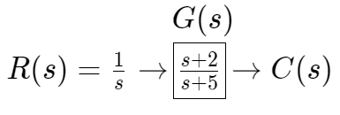
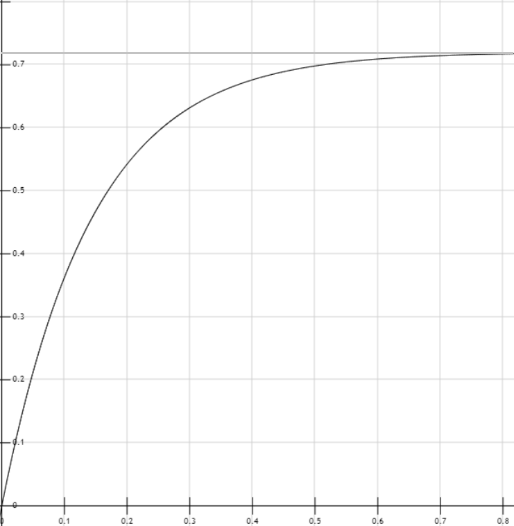

# 第四章 Transient Response暫態響應

- [第四章 Transient Response暫態響應](#第四章-transient-response暫態響應)
  - [簡單的意義](#簡單的意義)
  - [4.2 極點、零點 與 系統響應](#42-極點零點-與-系統響應)
    - [極點](#極點)
    - [零點](#零點)
    - [Ex. 求轉移函數$\frac{s-2}{s(s+5)}$](#ex-求轉移函數fracs-2ss5)
    - [Ex. 求輸出響應](#ex-求輸出響應)
    - [極點(poles)/零點(zeros)在系統響應中的規律](#極點poles零點zeros在系統響應中的規律)
  - [4.3 一階系統](#43-一階系統)
    - [響應時間有三種標準](#響應時間有三種標準)
      - [***Time constant時間常數***](#time-constant時間常數)
      - [***Rise time上升時間$T_r$***](#rise-time上升時間t_r)
      - [***Settling time安定時間$T_s$***](#settling-time安定時間t_s)
    - [整理](#整理)
    - [一階系統單位步階響應的特徵](#一階系統單位步階響應的特徵)
    - [系統鑑別](#系統鑑別)
  - [4.4 二階系統](#44-二階系統)
  - [4.5 通用二階系統](#45-通用二階系統)
  - [4.6 Unerdamped Second-Order Systems(欠阻尼二階系統)](#46-unerdamped-second-order-systems欠阻尼二階系統)
    - [定義暫態規格](#定義暫態規格)
    - [暫態規格公式](#暫態規格公式)
  - [4.7 增加額外極點之系統響應(System Response With Additional Poles)](#47-增加額外極點之系統響應system-response-with-additional-poles)
    - [將 ***三極點系統*** 近似為 ***兩極點系統***](#將-三極點系統-近似為-兩極點系統)
  - [4.8 含零點之系統響應(System Response With Zeros)](#48-含零點之系統響應system-response-with-zeros)

## 簡單的意義  

1. 系統響應就是輸出，系統響應 = 自然響應 + 強制響應
2. 強制響應才是我們期望系統該有的輸出
3. 自然響應是系統本身必然產生的輸出，是我們希望盡量避免的，所以越快衰減到 $0$ 越好

## 4.2 極點、零點 與 系統響應

|                 |       |                 |       |                  |
| :-------------: | :---: | :-------------: | :---: | :--------------: |
|  系統輸出響應   |   =   |    強制響應     |   +   |     自然響應     |
| System Response |   =   | Forced Response |   +   | Natural Response |

極點、零點都是頻域平面中 $s$ 變數的值(含實部虛部)  

### 極點

函數的極點定義：$\begin{array}{l} 1.此點代入函數，將算出無窮大 \\ 2.此點為函數分母的根(即使此根可與分子約分) \end{array}$  

### 零點

函數的零點定義：$\begin{array}{l} 1.此點代入函數，將算出\ 0 \\ 2.此點為函數分子的根(即使此根可與分母約分) \end{array}$

-------------------------------------------------------------------------------------------------------------------------------------------------------

### Ex. 求轉移函數$\frac{s-2}{s(s+5)}$

Poles(極點): $0,-5$  
Zeros(零點): $2$

-------------------------------------------------------------------------------------------------------------------------------------------------------

### Ex. 求輸出響應

  

$C(s) = G(s)R(s) = \frac{s+2}{s(s+5)} = \frac{a_1}{s+5}+\frac{a_2}{s}$  
$\Rightarrow C(s) = \frac{\frac{3}{5}}{s+5} + \frac{\frac{2}{5}}{s}$  
$\xrightarrow{\mathcal{L^{-1}}}c(t) = \frac{3}{5}e^{-5t}+\frac{2}{5}e^{0t}$ (輸出響應)  
其中  
$\frac{3}{5}e^{-5t}$ 稱為***自然響應***(因為輸出型式為$e$)， $-5$ 來自轉移函數 $G(s)$ 的極點pole($s = -5$)  
$\frac{2}{5}e^{0t}$ 稱為***強制響應***(因為是外部輸入在影響的，好像強迫系統輸出一樣)，$0$ 來自輸入函數 $R(s)$ 的極點  

可以歸納出  
$輸出響應 = 自然響應 + 強制響應$  

-------------------------------------------------------------------------------------------------------------------------------------------------------

### 極點(poles)/零點(zeros)在系統響應中的規律

1. 輸出響應 $=$ 自然響應 + 強制響應
2. 轉移函數的極點產生自然響應(記得轉移函數代表***系統本身的行為***)
3. 輸入函數的極點產生強制響應
4. 當自然響應衰減至 $0$ 以後，輸出就只剩下強制響應(外部輸入造成的部分)
5. ***轉移函數***在實部上的極點 ($s = -\alpha + j0$) 會產生 $e^{-\alpha t}$ 形式的輸出，由此可知，極點越左邊(越負)，***自然響應***會越快衰減至 $0$
6. 零點(zero)的作用  
   若 輸入$=\frac{1}{s-2}$，轉移函數$=\frac{s-2}{s+1}$，輸出$=$？  
   按照上面Ex的方法計算  
   $C(s) = \frac{1}{s-2}\times\frac{s-2}{s+1}$  
   $\Rightarrow C(s) = \frac{1}{s+1}$  
   $\xrightarrow{\mathcal{L^{-1}}}c(t) = e^{-1t}$  
   輸出只剩自然響應 $e^{-1t}$  
   強制響應 $e^{2t}$ 在計算過程中分子分母相消不見  
   $\Rightarrow$ 當我們把***轉移函數的零點***作為輸入時，輸出只會有自然響應，而自然響應會隨著時間衰減至$0$，變成 $0$ 輸出  
   $\Rightarrow$ 對系統輸入***零點***就不輸出  
   $\Rightarrow$ 轉移函數的零點***阻擋***特定的輸入
7. 暫時不懂

-------------------------------------------------------------------------------------------------------------------------------------------------------

## 4.3 一階系統

舉例一個不帶零點的一階系統 $G(s) = \frac{a}{s+a}, a \gt 0$  
並給定單位步階輸入 $R(s) = \frac{1}{s}$  
$\Rightarrow C(s) = R(s)G(s) = \frac{a}{s(s+a)} = \frac{1}{s}-\frac{1}{s+a}$  
$\xrightarrow{\mathcal{L^{-1}}} c(t)=1-e^{-at}$  
則 $1$ 為強制響應  
而 $-e^{-at}$ 為自然響應  
當 $t\rightarrow\infty$ 時，$-e^{-at}$ 會衰減至 $0$，只剩下強制響應 $1$，這也被稱為***穩態值***  

自然響應衰減至 $0$ 後達到***穩態***  
我們想知道達到穩態需要多少時間，也就是***響應時間***  

實際上需要無限多時間，但這不切實際，所以訂定標準，只要自然響應衰減到符合標準，就假裝系統已經達到穩態  

-------------------------------------------------------------------------------------------------------------------------------------------------------

### 響應時間有三種標準

-------------------------------------------------------------------------------------------------------------------------------------------------------

#### ***Time constant時間常數***

1. 自然響應衰減到初始的 $37\%$ 所需要的時間
2. 步階響應提升到 $63\%$ 所需要的時間

用1.求時間常數  
初始 $t=0$ $e^{-at} \Rightarrow e^{-a0} = 1$  
$37\%$自然響應$=0.37 = e^{-at}$  
$-at = \ln{0.37}\approx -1$  
$\Rightarrow -1 = -at$  
$\Rightarrow t=\frac{1}{a}$

用2.求時間常數  
$100\%$步階響應$=1-0=1$  
$63\%$步階響應$0.63=c(t)=1-e^{-at}$  
$\Rightarrow e^{-at}=0.37$  
$\Rightarrow t=\frac{1}{a}$  

-------------------------------------------------------------------------------------------------------------------------------------------------------

#### ***Rise time上升時間$T_r$***

輸出波型從$10\%$穩態值上升到$90\%$穩態值所需要的時間
$100\%$步階響應$=1-0=1$  
$90\%$步階響應$0.9=c(t)=1-e^{-at}$  
$\Rightarrow e^{-at}=0.1$  
$\Rightarrow -at = \ln{0.1}\approx -2.31$  
$\Rightarrow t=\frac{2.31}{a}$  
$10\%$步階響應$0.1=c(t)=1-e^{-at}$  
$\Rightarrow e^{-at}=0.9$  
$\Rightarrow -at = \ln{0.9}\approx -0.11$  
$\Rightarrow t=\frac{0.11}{a}$  
$T_r=\frac{2.31}{a}-\frac{0.11}{a}$  
$T_r=\frac{2.2}{a}$

-------------------------------------------------------------------------------------------------------------------------------------------------------

#### ***Settling time安定時間$T_s$***

達到$98\%$穩態值所需要的時間  

$100\%$步階響應$=1-0=1$  
$98\%$步階響應$0.98=c(t)=1-e^{-at}$  
$\Rightarrow e^{-at}=0.02$  
$\Rightarrow -at = \ln{0.02}\approx -4$  
$\Rightarrow t=\frac{4}{a}$  
$-at=-4$  
$t=\frac{4}{a}$  
$T_s=\frac{4}{a}$

-------------------------------------------------------------------------------------------------------------------------------------------------------

### 整理

$time\ constant=\frac{1}{a}$  
$T_r=\frac{2.2}{a}$  
$T_s=\frac{4}{a}$  

### 一階系統單位步階響應的特徵

1. 不會overshoot (超過穩態值)
2. 非零的初始斜率
3. $a$ 是唯一會影響暫態響應的參數，跟自然響應類似，$a$ 作為極點，越左邊(越負)，暫態響應越快衰減至 $0$

### 系統鑑別

給一個黑盒子系統  
意思就是，我們可以給這個系統輸入，也可以偵測輸出  
但不知道內部元件結構(也就是不知道轉移函數$G(s)$)  

假設我們測量該系統的單位步階響應如圖  
  

那麼理應可以根據測量結果推算出系統的轉移函數  

考慮一個簡單的一階系統，$G(s)=\frac{k}{s+a}$  
其步階響應為  
$C(s)=\frac{k}{s(s+a)}=\frac{\frac{k}{a}}{s}-\frac{\frac{k}{a}}{s+a}$  
$\Rightarrow c(t) = \frac{k}{a}e^{0t}-\frac{k}{a}e^{-at}$  
從測量圖中可以看出穩態值$c(\infin)=0.72\Rightarrow\frac{k}{a}=0.72$  
Time constant:  
$63\%\times c(\infin)\approx 0.45$  
直接看測量圖$c(t)=0.45$對應$t\approx 0.13$  
time constant $\approx 0.13$  
$\because t=\frac{1}{a}$  
$a\approx 7.7$  
$\frac{k}{a}=0.72 \Rightarrow k\approx 5.54$  
那麼就可以以此推論出轉移函數  
$G(s)=\frac{5.54}{s+7.7}$

## 4.4 二階系統

|          | 改變參數造成的影響 |
| :------- | :----------------- |
| 一階系統 | 響應***速度***     |
| 二階系統 | 響應***波型***     |

二階系統的單位步階響應***通式***  
$R(s)=\frac{1}{s}\rightarrow\frac{b}{s^2+as+b}\rightarrow C(s)\xrightarrow{\mathcal{L^{-1}}} c(t)=\begin{cases} k_1+k_2e^{\lambda_1t}+k_3e^{\lambda_2t}\ 轉移函數分母具相異實根 \\ k_1+k_2e^{\lambda t}+k_3e^{\lambda t}\ \ \ \ 轉移函數分母具相同實根 \end{cases}$  
其中 $\lambda_i$ 就是轉移函數的極點  

>前提：阻尼的意義  
>>類似於緩衝器、避震器的功能  
>>能量不夠(低於穩定值)就提供能量  
>>能量太多(高於穩定值)就吸收能量  
>
>運用此特性使系統的能量***盡快趨近於穩定***

常見的4種二階系統  

|          |       轉移函數       |                   自然響應                   |          極點$s$          |       |
| :------- | :------------------: | :------------------------------------------: | :-----------------------: | :---: |
| 無阻尼   |  $\frac{9}{s^2+9}$   |        $c(t)=A\cos{(\omega_1t-\phi)}$        |     $\pm{j\omega_1}$      |       |
| 欠阻尼   | $\frac{9}{s^2+2s+9}$ | $c(t)=Ae^{-\sigma_dt}\cos{(\omega_dt-\phi)}$ | $-\sigma_d\pm{j\omega_d}$ |       |
| 臨界阻尼 | $\frac{9}{s^2+6s+9}$ | $c(t)=k_1e^{-\sigma_1t}+k_2te^{-\sigma_1t}$  |      $-\sigma_1$重根      |       |
| 過阻尼   | $\frac{9}{s^2+9s+9}$ |  $c(t)=k_1e^{-\sigma_1t}+k_2e^{-\sigma_2t}$  |  $-\sigma_1, -\sigma_2$   |       |

極點的實部代表響應的指數衰減(越負衰減越快)  
極點的虛部代表震盪頻率(絕對值越大)  

無震盪時，可以明顯看出極點實部在波型上產生的指數衰減  
具有震盪時，要看波型的波峰，則可以看出指數衰減  

過阻尼：阻尼太高的時候，會在前期吸收太多能量，以至於較慢達到穩態  
欠阻尼：阻尼不夠的時候，會 高過穩態->低過穩態->反覆進行  
臨界阻尼：阻尼恰到好處，能以最快的速度趨近於穩態  
這邊找到一個相當好懂的示意圖  
  
[圖片](https://highscope.ch.ntu.edu.tw/wordpress/wp-content/uploads/2014/12/Fig-2-Damped-Swinging-Doors-Animation.gif)|[來源](https://highscope.ch.ntu.edu.tw/wordpress/?p=59534)

## 4.5 通用二階系統

回想二階系統通式  
$R(s)=\frac{1}{s}\rightarrow\frac{b}{s^2+as+b}\rightarrow C(s)$  
$a$ 值決定此為哪種阻尼系統  
這邊要記得，分子為常數時，極點就是分母的根，可以用 $\frac{-b\pm{\sqrt{b^2-4ac}}}{2a}$  
>***$\Rightarrow$ 極點 $=\frac{-a\pm{\sqrt{a^2-4b}}}{2}$***

|                        |                      |                      |                      |                      |
| :--------------------: | :------------------: | :------------------: | :------------------: | :------------------: |
|       $a$ 的條件       |        $a=0$         |    $a^2-4b\lt 0$     |      $a^2-4b=0$      |    $a^2-4b\gt 0$     |
|                        |        無阻尼        |        欠阻尼        |       臨界阻尼       |        過阻尼        |
|     系統(轉移函數)     | $\frac{9}{s^2+0s+9}$ | $\frac{9}{s^2+2s+9}$ | $\frac{9}{s^2+6s+9}$ | $\frac{9}{s^2+9s+9}$ |
| 系統極點(轉移函數極點) |   $\pm{j\sqrt{9}}$   |  $-1\pm{j\sqrt{8}}$  |       $-3,-3$        |   $-7.854,-1.146$    |
|        震盪程度        |       保持震盪       |      衰減式震盪      |        不震盪        |        不震盪        |
|                        |                      |                      |                      |                      |

我們可以定義兩種參數來分辨二階系統的特性  
1. natural frequency(自然頻率), $\omega_n$:  
   無阻尼下，此系統天生自帶的震盪頻率
2. dampling ratio(阻尼比), $\zeta$ (念作[[zeta]](https://zh.wikipedia.org/wiki/%CE%96)):  
   $\zeta=\frac{指數衰減率(極點實部)}{自然頻率\omega_n(=\sqrt{b})}$

可以將此二參數反寫回通式中  
$R(s)=\frac{1}{s}\rightarrow\frac{\omega_n^2}{s^2+2\zeta\omega_n s+\omega_n^2}\rightarrow C(s)$  

並且改為用 阻尼比 $\zeta$ 來分類  
|                  |          |
| :--------------: | :------: |
|    $\zeta=0$     |  無阻尼  |
| $0\lt\zeta\lt 1$ |  欠阻尼  |
|    $\zeta=1$     | 臨界阻尼 |
|   $1\lt\zeta$    |  過阻尼  |

$\zeta$ 阻尼越小，震盪越大  
$\zeta$ 阻尼越大，震盪越小  

## 4.6 Unerdamped Second-Order Systems(欠阻尼二階系統)

物理問題經常使用這種模型  
在欠阻尼中，$0\lt\zeta\lt1$  

### 定義暫態規格

1. Rise time 上升時間 $T_r$：輸出波型從穩態值的$10\%$ ~ 穩態值的$90\%$所需要的時間
2. Peak time 峰值時間 $T_p$：達到第一個或最大峰值所需要的時間(hint: 峰值的斜率$=0$)
3. Percent overshoot 超越量百分比 $\%OS$：峰值超過穩態的量  
   $\%OS=\frac{c_{max}-c_{final}}{c_{final}}\times 100$
4. Settling time 安定時間 $T_s$：暫態的阻尼震盪，達到只在穩態值的$\pm2\%$之間震盪，所需要的時間

-------------------------------------------------------------------------------------------------------------------------------------------------------

Ex. 求峰值時間 $T_p$  
$T_p$ 為 $c'(t)=0$ 所需的時間 $t$  
$\mathcal{L}[c'(t)]=sC(s)=s\times\frac{\omega_n^2}{s^2+2\zeta\omega_ns+\omega_n^2}\times\frac{1}{s}(步階輸入)=\frac{\omega_n^2}{s^2+2\zeta\omega_ns+\omega_n^2}$  
$=\frac{\omega_n^2}{(s+\zeta\omega_n)^2+\omega_n^2(1-\zeta^2)}=\frac{\omega_n}{\sqrt{1-\zeta^2}}\times\frac{\omega_n\sqrt{1-\zeta^2}}{(s+\zeta\omega_n)^2+(\omega_n\sqrt{1-\zeta^2})^2}$  
>$\because\\\begin{cases}\frac{1}{s+a}\rightarrow e^{-at}\\ \frac{\omega}{s^2+\omega^2}\rightarrow\sin{(\omega t)}\end{cases}$  $\Rightarrow \frac{\omega}{(s+a)^2+\omega^2}\rightarrow e^{-at}\sin{\omega t}$  
>$\begin{cases}a=\zeta\omega_n \\ \omega=\omega_n\sqrt{1-\zeta^2}\end{cases}$

$\xrightarrow{L^{-1}}c'(t)=\frac{\omega_n}{\sqrt{1-\zeta^2}}e^{-\zeta\omega_nt}\sin{(\omega_n\sqrt{1-\zeta^2}t)}$  
$c'(t)=0$ 的條件為 $\omega_n\sqrt{1-\zeta^2}t=n\pi$ (迫使 $\sin=0$)，其中 $n$ 為整數  
移項 $t=\frac{n\pi}{\omega_n\sqrt{1-\zeta^2}}$  
$n=0, t=0$ 起始點非峰值  
$n=1, t=\frac{n\pi}{\omega_n\sqrt{1-\zeta^2}}$ 第一個峰值時間

-------------------------------------------------------------------------------------------------------------------------------------------------------

Ex. 求 $\%OS$  

-------------------------------------------------------------------------------------------------------------------------------------------------------

Ex. 求 $T_s$  

-------------------------------------------------------------------------------------------------------------------------------------------------------

Ex. 求 $T_r$  

-------------------------------------------------------------------------------------------------------------------------------------------------------

### 暫態規格公式

1. $T_p=\frac{\pi}{\omega_n\sqrt{1-\zeta^2}}=\frac{\pi}{\lvert Im(pole) \rvert}$  
   $Im(pole)$極點虛部  
2. $T_s=\frac{4}{\zeta\omega_n}=\frac{4}{\lvert Re(pole) \rvert}$  
   $Re(pole)$極點實部  
3. $\%OS=e^{-\frac{\zeta\pi}{\sqrt{1-\zeta^2}}}\times100=e^{-\pi\cot{(\theta)}}$  
   $\theta=\cos^{-1}{(\zeta)}, \ \ \ \ \ \zeta=\cos{(\theta)}$
4. $\zeta=-\frac{\ln{(\frac{\%OS}{100})}}{\sqrt{\pi^2+(\ln{(\frac{\%OS}{100})})^2}}$

-------------------------------------------------------------------------------------------------------------------------------------------------------

## 4.7 增加額外極點之系統響應(System Response With Additional Poles)

超越量百分比 $\% OS$、安定時間 $T_s$ 、峰值時間 $T_p$ 的公式僅適用於 ***恰兩個複數極點*** 且 ***無零點*** 的系統  
兩個以上極點 或 具有零點則無法透過公式推導  

但在特定情況下，則可以被近似為 ***恰兩個複數主極點(dominant poles)的二階系統***  
那麼就可以藉由主極點的位置使用  
超越量百分比 $\% OS$、安定時間 $T_s$ 、峰值時間 $T_p$ 的公式  

-------------------------------------------------------------------------------------------------------------------------------------------------------

### 將 ***三極點系統*** 近似為 ***兩極點系統***

現有一個三極點系統，其極點為 $-\zeta\omega_n\pm j\omega_n\sqrt{1-\zeta^2}$ , $-\alpha_r$ (兩複數極點、一實數極點)  

此系統的步階響應經由部分分式展開可得：  
$C(s)=\frac{A}{s}+\frac{B(s+\zeta\omega_n)+C\omega_d}{(s+\zeta\omega_n)^2+{\omega_d}^2}+\frac{D}{s+\alpha_r}$  
轉到時域則為：  
$\xrightarrow{\mathcal{L^{-1}}}c(t)=Au(t)+e^{-\zeta\omega_n t}(B\cos{(\omega_d t)}+C\sin{(\omega_d t)})+De^{-\alpha_r t}$  

-------------------------------------------------------------------------------------------------------------------------------------------------------

## 4.8 含零點之系統響應(System Response With Zeros)

