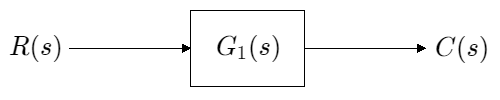
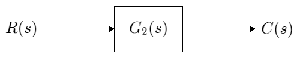
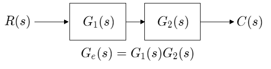

# 第五章 等效多重系統 Equivalent Systems

-------------------------------------------------------------------------------------------------------------------------------------------------------

## 公式回顧

二階系統通式：$R(s)=\frac{1}{s}\rightarrow\frac{\omega_n^2}{s^2+2\zeta\omega_n s+\omega_n^2}\rightarrow C(s)$  

1. Rise time 上升時間 $T_r$：輸出波型從穩態值的$10\%$ ~ 穩態值的$90\%$所需要的時間
2. Peak time 峰值時間：  
   $T_p=\frac{\pi}{\omega_n\sqrt{1-\zeta^2}}=\frac{\pi}{\lvert Im(pole) \rvert}$  
   *$Im(pole)$極點虛部*  
3. Settling time 安定時間：  
   $T_s=\frac{4}{\zeta\omega_n}=\frac{4}{\lvert Re(pole) \rvert}$  
   *$Re(pole)$極點實部*  
4. Percent overshoot 超越量百分比：  
   $\%OS=e^{-\frac{\zeta\pi}{\sqrt{1-\zeta^2}}}\times100=e^{-\pi\cot{(\theta)}}$  
   $\theta=\cos^{-1}{(\zeta)}, \ \ \ \ \ \zeta=\cos{(\theta)}$
5. $\zeta=-\frac{\ln{(\frac{\%OS}{100})}}{\sqrt{\pi^2+(\ln{(\frac{\%OS}{100})})^2}}$

-------------------------------------------------------------------------------------------------------------------------------------------------------

## 本章節重點與目的

將複雜的、具有多個子系統的***大系統***以簡化的數學模型進行***等效***  
再透過第四章的公式求該系統的暫態規格  
或是根據第四章的公式，設計系統以符合所需的暫態規格  

## 前言

多重子系統可以被表示為  

1. 方塊圖 block diagrams
2. 訊號流程圖 signal-flow graphs

常見互相連接的子系統之拓樸  

1. 串聯  cascade　form
2. 並聯  parallel form
3. 回授  feedback form

## 5-2 方塊圖

$R(s)$  
$G_1(s)$  
$G_2(s)$  
$G_e(s)=G_1(s)G_2(s)$  
$C(s)$  

### 串聯

  
  
  

### 並聯

### 回授

### Ex 5.4

## 5-4

## 5-5 Mason's Rule 梅生法則

$G(s)=\frac{C(s)}{R(s)}=\frac{\Sigma_k{T_k\Delta_k}}{\Delta}$  
$k=$ 順向路徑的數目  
$T_k=第k條順向路徑的增益$  
$\Delta=1-\Sigma{(迴路增益)}+\Sigma{(每兩個untouching loop gain)}-\Sigma{(每三個untouching loop gain)}+\Sigma{(每四個untouching loop gain)}...$  
$\Delta_k=\Delta-\Sigma{(在\Delta中接觸到第k條順向路徑之「迴路增益」項)}$  

## 5-6

## 5-7

## 5-8
