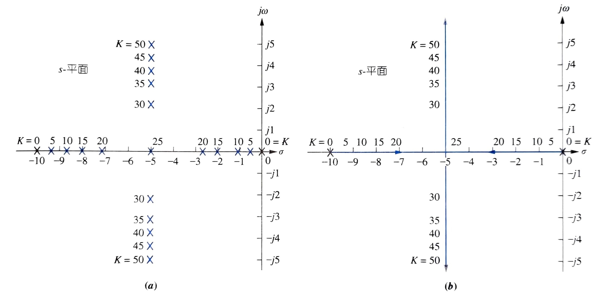
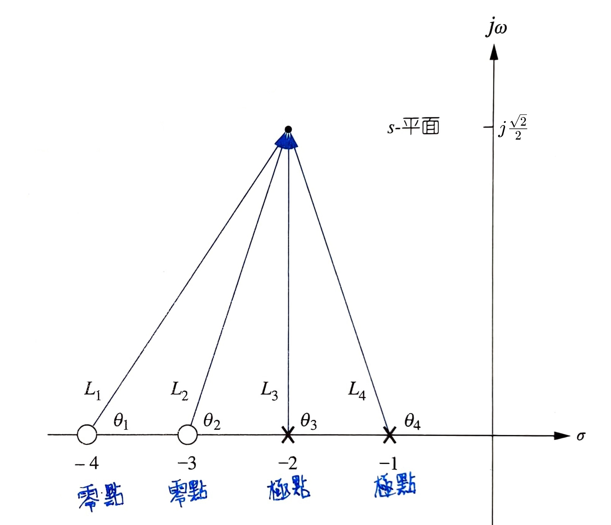
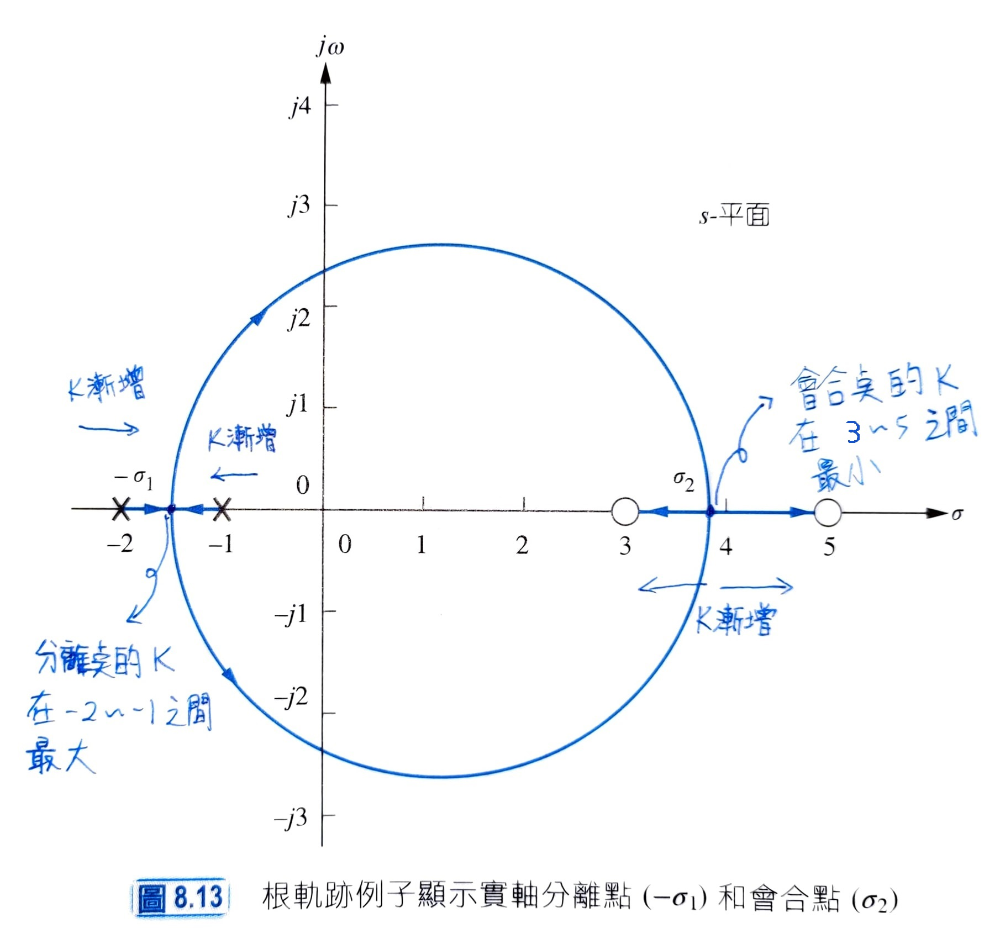
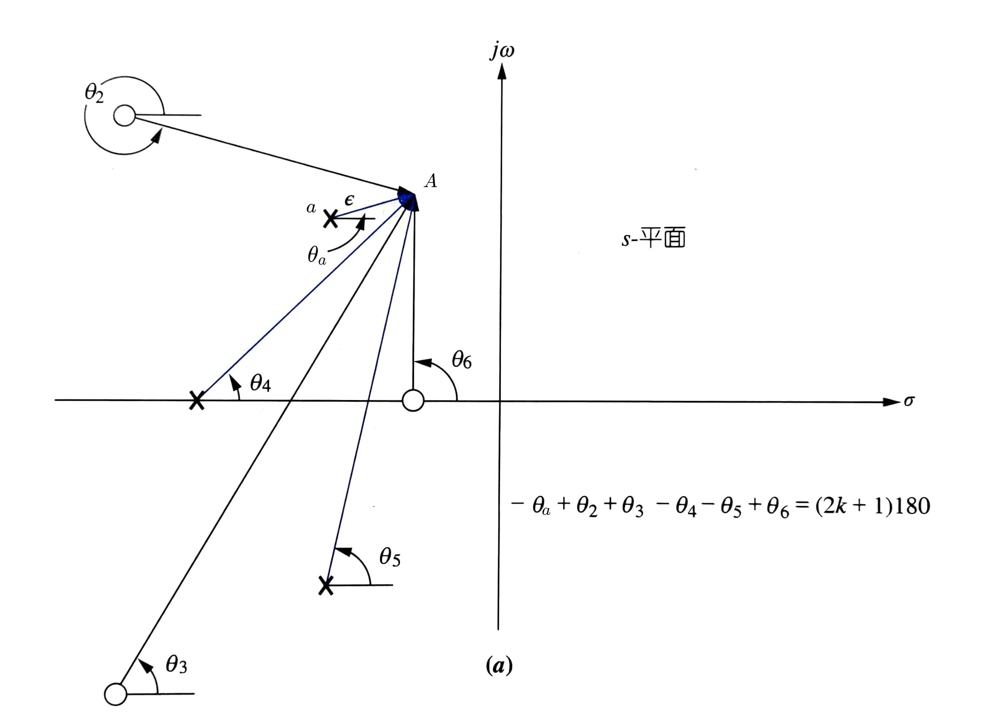
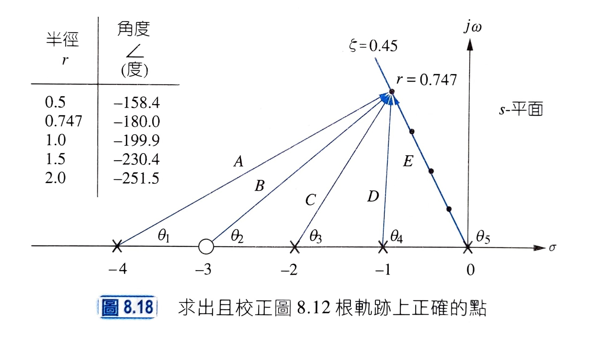
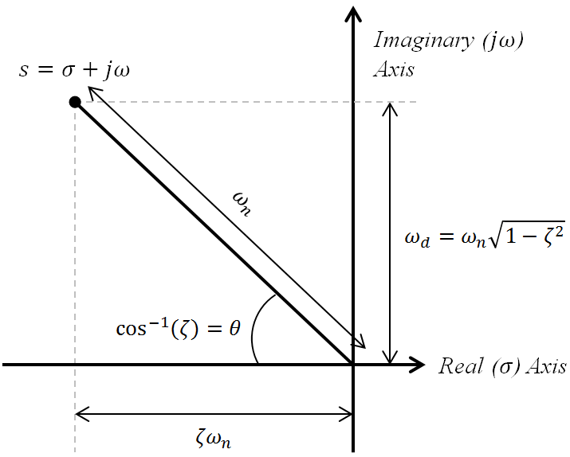

# **Ch08 Root Locus Techniques - PartⅠ**

- [**Ch08 Root Locus Techniques - PartⅠ**](#ch08-root-locus-techniques---partⅰ)
  - [**注意**](#注意)
  - [**8.2 定義根軌跡 Defining the Root Locus**](#82-定義根軌跡-defining-the-root-locus)
  - [**8.3 根軌跡的特性 Properties of the Root Locus**](#83-根軌跡的特性-properties-of-the-root-locus)
      - [則 滿足 $KG(s)H(s)=-1$ 的 $s$ 即為閉迴路極點（ 使$T(s)$的分母為$0$ ）](#則-滿足-kgshs-1-的-s-即為閉迴路極點-使ts的分母為0-)
  - [**8.4 概略繪製根軌跡 Sketching the Root Locus**](#84-概略繪製根軌跡-sketching-the-root-locus)
  - [**8.5 修飾根軌跡 Refining the Sketch**](#85-修飾根軌跡-refining-the-sketch)
    - [**實軸分離與會合點 Real-Axis Breakaway and Break-In Points**](#實軸分離與會合點-real-axis-breakaway-and-break-in-points)
    - [**與$j\omega$軸的交越點 _The_ $j\omega$_-Axis Crossings_**](#與jomega軸的交越點-the-jomega-axis-crossings)
    - [**分離角與到達角 _Angles of Departure and Arrival_**](#分離角與到達角-angles-of-departure-and-arrival)
    - [**畫出與校正根軌跡 Plotting and Calibrating the Root Locus**](#畫出與校正根軌跡-plotting-and-calibrating-the-root-locus)
      - [阻尼比線畫法](#阻尼比線畫法)

## **注意**

內容在講「極點」、「零點」的時候，時常有區分是「**開迴路**」或者「**閉迴路**」  
要釐清每一次在講這些點是哪種迴路的情況才不會被搞混  
開迴路：不考慮迴授 $G(s)$  
閉迴路：需要考慮回授 $\frac{G(s)}{1\pm G(s)H(s)}$  

## **8.2 定義根軌跡 Defining the Root Locus**

假設閉迴路轉移函數為$\frac{K}{s^2+10s+K}$  
調整 增益 $K$ 時，**閉迴路**極點變化所描繪出的軌跡圖(畫在複數平面上)  
通常只探討正增益($K\ge 0$)  

>recall: 極點為使函數 $\infin$ 的點，同時是函數分母的根

上圖中  
橫排的$K$值使系統為過阻尼、  
$K=25$使系統為臨界阻尼、  
直排的$K$值使系統為欠阻尼

>recall:
>>極點為雙實數根：過阻尼  
>>極點為重根：臨界阻尼  
>>極點為共軛複數根：欠阻尼  

安定時間 $T_s$：暫態達到穩態的 $\pm 2\%$ 所需時間。$T_s = \frac{4}{\zeta\omega_n} = \frac{4}{|Re(pole)|}$  
由此公式可以發現，$T_s$只受到極點實部影響，因此當系統**被限定在欠阻尼**時(極點軌跡的實部不變)，$K$ 值不論多少都不影響 $T_s$  

## **8.3 根軌跡的特性 Properties of the Root Locus**

>先要意識到根軌跡是由**閉迴路**極點繪製出  

隨選一點$P$，測試$P$在特定$K$值下，是否為該系統的**閉迴路**極點（＝是否位在該系統的根軌跡上）  
給定一個閉迴路系統  
$T(s)=\frac{KG(s)}{1+KG(s)H(s)}$  
#### 則 滿足 $KG(s)H(s)=-1$ 的 $s$ 即為閉迴路極點（ 使$T(s)$的分母為$0$ ）

  

1. 將該系統的**開迴路**零點與極點畫出
2. 將點$P$與**開迴路**零點與極點連線（記得我們是測試$P$是否為**閉迴路**極點）
3. 將 $零點連線角度和 - 極點連線角度和$ 若為 $180\degree$ 的**奇數倍**，則$P$位於根軌跡上，反之則否

確定$P$在根軌跡上後，找出使 $P$ 為極點的 $K$ 值（調整$K$到某值時，極點為$P$）  
$K = \frac{極點連線長度乘積}{零點連線長度乘積} = \frac{L_3L_4}{L_1L_2} = 0.33$  

## **8.4 概略繪製根軌跡 Sketching the Root Locus**

利用以下五個規則來畫根軌跡圖  

1. 分支數(branch)：  
   $K$值變化時每個極點會隨著自己的軌跡移動，因此有 $n$ 個極點，所畫出的圖就會有 $n$ 道軌跡（分支）
2. 對稱性(symmetry)：  
   根軌跡會對稱於實數軸
3. 實軸節段(real-axis segments)：  
   在$K\gt 0$的前提下，根軌跡會通過 奇數個**開迴路**零點／奇數個**開迴路**極點 的左側
4. 起點與終點：  
   根軌跡起於**開迴路**極點，終止於**開迴路**零點  
   記得起點到終點的行進來自$K$值的調整，可以參考第一張圖片中，$K$從$0$～$50$的調整過程中，極點是怎麼跑的
5. 極點/零點 在無限大的行為：  
   最簡單的例子  
   $G(s) = s$，則極點 $s = \infin$  
   $G(s) = \frac{1}{s}$，則零點 $s = \infin$  
   因此**開迴路** $KG(s)H(s)=\frac{K}{s(s+1)(s+2)}$ 具備 極點 $s=0,-1,-2$ 與 零點 $s=\infin,\infin,\infin$  
   套用規則 4. 的話，根軌跡起於**開迴路**極點，終止於**開迴路**零點，零點無窮大，因此根軌跡將沿著漸進線趨於無窮大

## **8.5 修飾根軌跡 Refining the Sketch**

先用[8.4節](#84-概略繪製根軌跡-sketching-the-root-locus)草繪出根軌跡，再用本節的技巧將細節修正  

### **實軸分離與會合點 Real-Axis Breakaway and Break-In Points**

  

$K=0$ 時兩個極點在 $s=-1,-2$，當 $K$ 漸增時 極點靠攏  
$K$ 持續漸增，兩極點重合後，極點向複數平面前進，因此在 $s=-1$ ~ $-2$ 這個實數軸段之間(**開迴路**極點之間)，分離點所在的 $K$ 值最大  

相對的，抵達會合點後，$K$ 漸增，且極點於實數軸段 $s=3$ ~ $5$ 分離，$K$ 持續漸增，因此在實數軸段 $s=3$ ~ $5$ 之間(**開迴路**零點之間)，會合點所在的 $K$ 值最大  

>有三種方法求分離點與會合點  
>
>>一、用微分計算求最大與最小增益 $K$
>>
>>由[閉迴路極點條件式](#則-滿足-kgshs-1-的-s-即為閉迴路極點-使ts的分母為0-)得到  
>>$$K=-\frac{1}{G(s)H(s)}$$  
>>我們只考慮沿著實軸的部分，因此可以改寫為  
>>$$K=-\frac{1}{G(\sigma)H(\sigma)}$$  
>>並以 $\sigma$ 對 $K$ 作圖  
>>  
>>對其微分即可找到 $K$ 的 最大/最小 值  
>
>>二、轉移法  
>>不必微分  
>>滿足下列關係式的 $\sigma$ 即為分離點/會合點  
>>$$\sum^m_1{\frac{1}{\sigma+z_i}}=\sum^n_1{\frac{1}{\sigma+p_i}}$$  
>>其中  
>>$m$ 為**開迴路**零點個數、$z_i$ 為 $-zero$  
>>$n$ 為**開迴路**極點個數、$p_i$ 為 $-pole$  
>>沿用前面的圖  
>>開迴路零點 $3$、$5$  
>>開迴路極點 $-1$、$-2$  
>>則關係式可寫為  
>>$$\frac{1}{\sigma -3}+\frac{1}{\sigma-5}=\frac{1}{\sigma +1}+\frac{1}{\sigma +2}$$  
>>簡化後  
>>$$11\sigma^2-26\sigma-61=0$$  
>>就可以找到 $\sigma = -1.45、3.82$ 為 分離點與會合點  
>
>>三、用Matlab  

### **與$j\omega$軸的交越點 _The_ $j\omega$_-Axis Crossings_**

>recall:  
>**閉迴路極點**在虛軸($j\omega$)左側時，閉迴路系統**穩定**  
>**閉迴路極點**在虛軸($j\omega$)右側時，閉迴路系統**不穩定**  

因此根軌跡與虛軸($j\omega$)的交點即為系統穩定與否的分界點  
分界點上的$K$值則被視為系統穩定下的**最大增益**(記得根軌跡是在$K$值漸增下從左半跑到右半)  

### **分離角與到達角 _Angles of Departure and Arrival_**

  

假設根軌跡上一點$A$，與開迴路極點 $a$ 非常靠近，且距離為 $\epsilon$，$Aa$連線與實數軸所呈的角度為 $\theta_a$  
$\theta_a$ 是我們要計算出的分離角  
(想像一下，點$A$在根軌跡上滑動並經過 $a$ 時產生的角度)  
這邊因為 $\epsilon$ 很小，我們難以直接利用座標配合畢氏定理得出角度  
但可以利用  
$(零點角度和)-(極點角度和)=(2k+1)180\degree$ 得出  
其他零點、極點因為與$A$距離夠遠，可以直接從座標差算出角度，因此$\theta_2$~$\theta_6$視為已知  
將公式列出：  
$(\theta_2+\theta_3+\theta_6)-(\theta_1+\theta_4+\theta_5)=(2k+1)180\degree$  
$\Rightarrow\theta_a=(\theta_2+\theta_3+\theta_6)-(\theta_4+\theta_5)-(2k+1)180\degree$  
即可算出分離角$\theta_a$  

到達角的話改成取與零點 $b$ 非常靠近的根軌跡上一點$B$，並以同樣的公式計算出 $\theta_b$即可  

### **畫出與校正根軌跡 Plotting and Calibrating the Root Locus**

目標：要求得根軌跡上哪一點使 $\zeta=0.45$，並得到其增益  

  

畫出 $\zeta=0.45$ 的線([阻尼比線繪製方法](#阻尼比線畫法))  
在這條線上逐點尋找哪一個點可以滿足根軌跡的條件：  
$(零點角度和)-(極點角度和)=(2k+1)180\degree$  
此圖中在 $r=0.747$ 找到 $\theta_2-(\theta_1+\theta_3+\theta_4+\theta_5)=-180\degree$  
因此，根軌跡(圖中未畫出)會通過 $\zeta=0.45$ 線上 $r=0.747$ 這個點  
此點的增益 $K$ 滿足 $K=\frac{極點連線長度乘積}{零點連線長度乘積}$ 這個公式  
因此 $K=\frac{ACDE}{B}$  
$-5\ -1\ 2$
 

 

 

 

 

 

 

 

 

 

 

 

 

 

 

 

 

 

 

 

 

 

 

 

 

 

 

 

 

 

 

 

 

 

 

 

#### 阻尼比線畫法

[返回](#畫出與校正根軌跡-plotting-and-calibrating-the-root-locus)  
可用目標 $\zeta$ 配合 $\cos^{-1}{\zeta}=\theta$ 得到角度並畫出阻尼比線  

