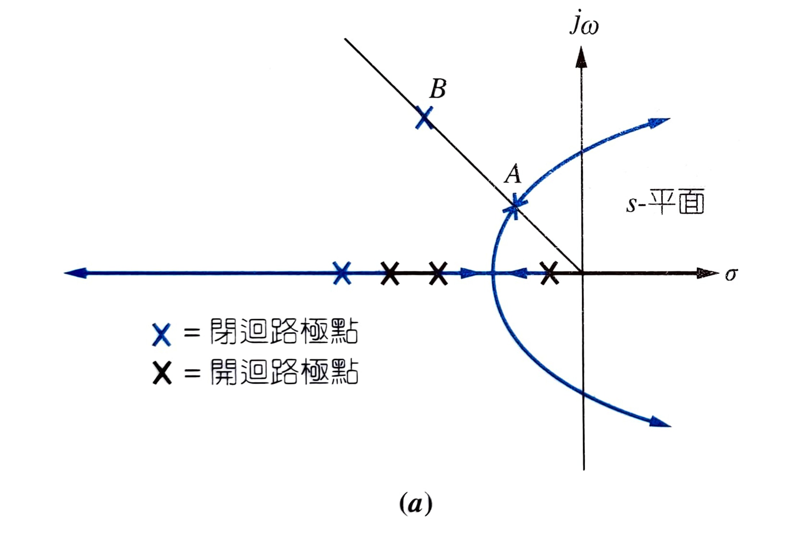
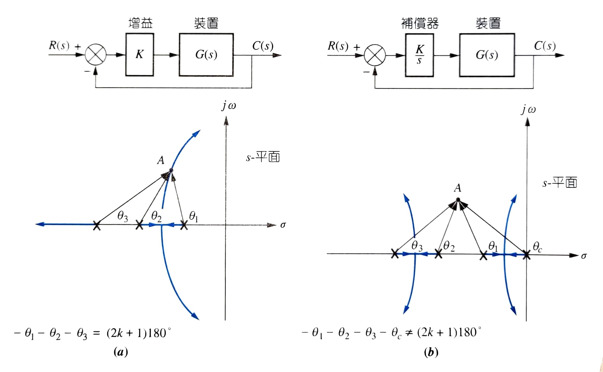
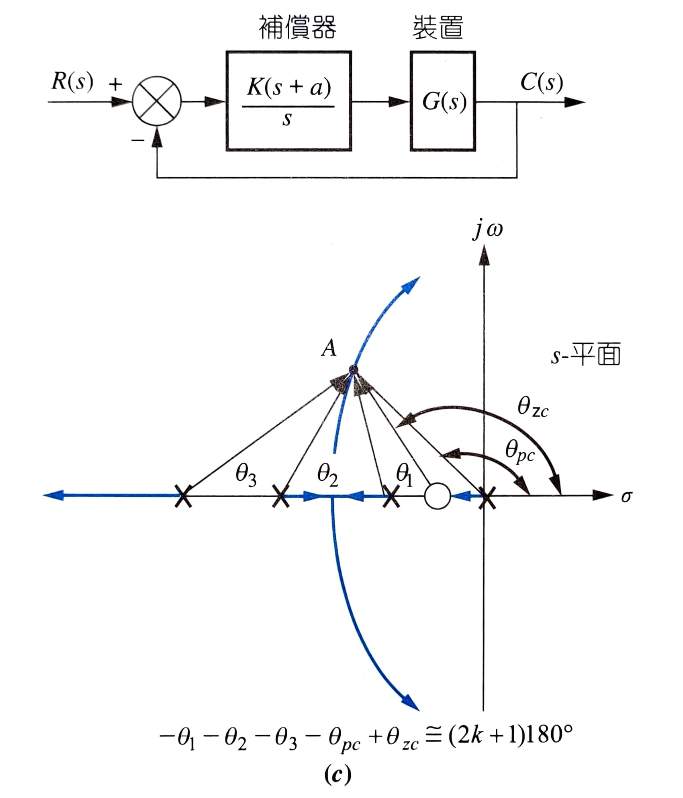
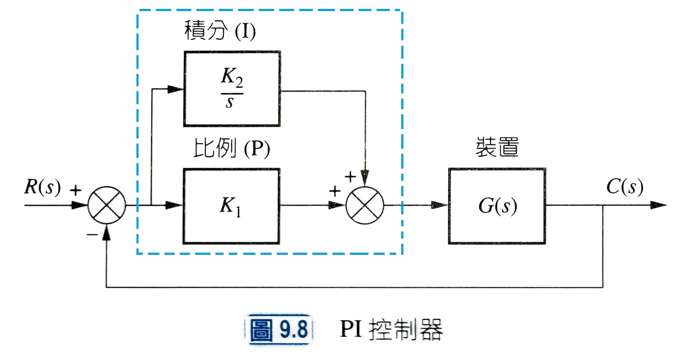
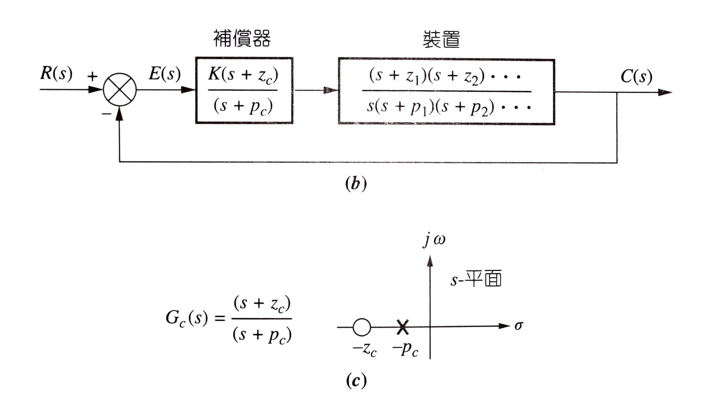
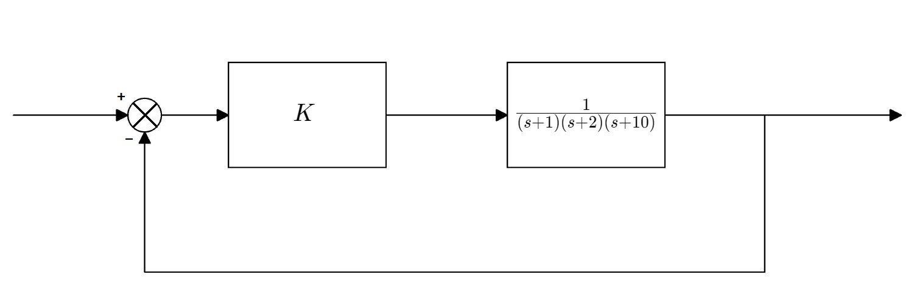
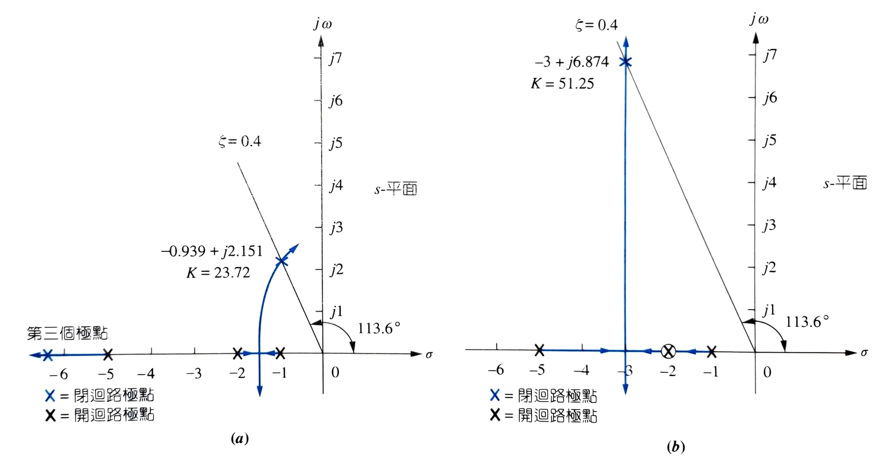
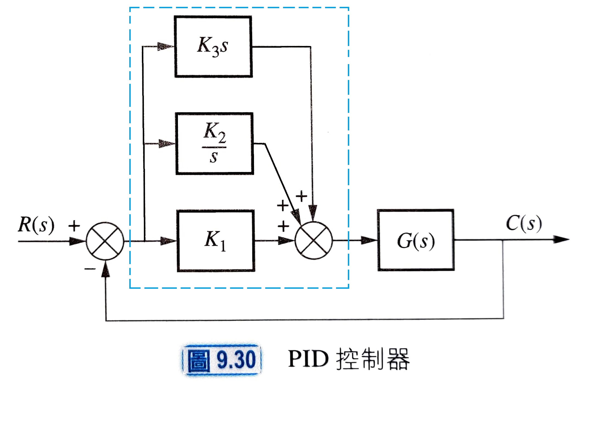

# **Ch09 Root Locus Techniques - PartⅡ**

- [**Ch09 Root Locus Techniques - PartⅡ**](#ch09-root-locus-techniques---partⅱ)
  - [**Ⅰ- 調整增益來設計根軌跡 Root Locus design via gain adjustment**](#ⅰ--調整增益來設計根軌跡-root-locus-design-via-gain-adjustment)
  - [**Ⅱ- 動態補償來設計根軌跡 Root Locus design via dynamic compensation**](#ⅱ--動態補償來設計根軌跡-root-locus-design-via-dynamic-compensation)
    - [**理想積分補償 Ideal Integral Compensation (PI)**](#理想積分補償-ideal-integral-compensation-pi)
    - [**落後補償 Lag Compensation**](#落後補償-lag-compensation)
    - [**理想微分補償 Ideal Derivative Compensation (PD)**](#理想微分補償-ideal-derivative-compensation-pd)
    - [**領前補償 Lead Compensation**](#領前補償-lead-compensation)
    - [**積分微分器 PID**](#積分微分器-pid)

對應課本Ch8.7開始  

## **Ⅰ- 調整增益來設計根軌跡 Root Locus design via gain adjustment**

1. 把目標規格轉換成所需的極點位置(比方說$\%OS$→符合的極點位置呈放射線)  
2. 畫出給定系統的根軌跡  
3. 找到符合目標規格的極點所具有的增益$K$(根軌跡與 1. 的交點)
4. 驗證是否可用假定的二階系統去近似這個給定的系統  
5. 

## **Ⅱ- 動態補償來設計根軌跡 Root Locus design via dynamic compensation**

>改善[暫態響應/穩態誤差] Improving [Transient Response/Steady-State Error]  
>  
>
>當我們想要的暫態響應/穩態誤差，只能以不在根軌跡上的極點(B點)來達成時，就無法僅僅透過改變增益$K$來實現（記得根軌跡是 $K$ 從 $0$ 漸增，極點的改變軌跡畫出來的）  
>可以透過**加入**極點/零點來補償(compensate)這個系統，使根軌跡通過我們要求的B點  
>
>>在順向路徑上添加**微分器**來改善**暫態響應** $\times\frac{s}{1} \Rightarrow$ 增加零點  
>
>>在順向路徑上添加**積分器**來改善**穩態誤差** $\times\frac{1}{s} \Rightarrow$ 增加極點  

|             改善             | 使用的Controller |
| :--------------------------: | :--------------: |
|     暫態響應(transient)      |    PD / Lead     |
| 穩態誤差(steady-state error) |     PI / Lag     |
|           都要改善           |  PID / Lag-lead  |

>recall:  
>添加極點 $=$ 加上積分器 $=\times\frac{1}{s}=$ 系統型態增加1  
>>|            輸入            |     穩態誤差      | 型態0 靜態誤差常數 |      誤差     | 型態1 靜態誤差常數 |     誤差    | 型態2 靜態誤差常數 |     誤差    |
>>| :------------------------: | :---------------: | :--------------------: | :---------------: | :--------------------: | :-------------: | :--------------------: | :-------------: |
>>|         步階$u(t)$         | $\frac{1}{1+K_p}$ |       $K_p=常數$       | $\frac{1}{1+K_p}$ |      $K_p=\infin$      |       $0$       |      $K_p=\infin$      |       $0$       |
>>|        斜坡$tu(t)$         |  $\frac{1}{K_v}$  |        $K_v=0$         |     $\infin$      |       $K_v=常數$       | $\frac{1}{K_v}$ |      $K_v=\infin$      |       $0$       |
>>| 拋物線$\frac{1}{2}t^2u(t)$ |  $\frac{1}{K_a}$  |        $K_a=0$         |     $\infin$      |        $K_a=0$         |    $\infin$     |       $K_a=常數$       | $\frac{1}{K_a}$ |

### **理想積分補償 Ideal Integral Compensation (PI)**

  

假設$A$點符合**暫態誤差**需求  
表示原本的系統$(a)$符合此需求，在**固定暫態誤差**的前提上我們希望改善**穩態誤差**  

在前級串接一個積分器 $\frac{1}{s}$ 形同增加一個位在$s=0$的極點  
>在原點位置增加極點可以改善**穩態誤差**，但這樣會使得**根軌跡**偏離我們所需的**暫態誤差**(根軌跡不再通過$A$點)  

要解決此問題，只要在剛剛加入的**極點附近**再添加一個**零點**即可解決 $\Rightarrow\times\frac{s+a}{1}$  
recall:$(零點角度和)-(極點角度和)=(2k+1)180\degree$  
因此位置接近的極點與零點之角度會大約抵銷  

  
在這個調整後的系統中，符合所需**暫態誤差**的$A$點**大約**在根軌跡上  

這邊可以得出一個觀點：理想積分補償器大致上要有 $\frac{K(s+a)}{s}$ 這個形式  

 

實作一個理想積分補償器的方法如圖  
虛線框框的部分就是PI控制器  

  

PI控制器$=K_1+\frac{K_2}{s}=\frac{K_1(s+\frac{K_2}{K_1})}{s}$  
則所添加的極點位於**原點**($s=0$)  
所添加的**零點**位於$s=-\frac{K_2}{K_1}$  

也就是說我們可以透過改變$\frac{K_2}{K_1}$來調整所添加**零點**的位置  

### **落後補償 Lag Compensation**

>Lag控制器$=K\frac{s+z_c}{s+p_c}$  
>其中 $\frac{z_c}{p_c}$ 要很大，且 $z_c$、$p_c$ 要足夠靠近  
>因此 $p_c$ 必須非常靠近原點$p_c\approx 0$ 才能達成  

也就是添加了 零點$s=-z_c$、極點$s=-p_c$  
零點極點與PI控制器一樣要足夠靠近($\therefore \frac{s+z_c}{s+p_c}\approx 1$)才能使角度大致相消  
  

造成的效果：  
$\frac{K_N}{K_O}=\frac{補償前靜態誤差常數}{補償後靜態誤差常數}=\frac{z_c}{p_c}$  

>recall:
>|                                          |        用**開迴路**$G$去算                            |
>| :--------------------------------------: | :--------------------------------: |
>|     位置常數(position constant)$K_p$     |  $K_p=\lim_{s\to 0}G(s)$   |
>|     速度常數(velocity constant)$K_v$     |  $K_v=\lim_{s\to 0}sG(s)$  |
>| 等加速度常數(acceleration constant)$K_a$ | $K_a=\lim_{s\to 0}s^2G(s)$ |
　　
>### Ex. 設計一個Lag Controller使以下未補償系統改善穩態誤差$e(\infin)$ 10倍($new\ \  e(\infin)=\frac{1}{10}e(\infin)$)並且滿足$\zeta=0.714$
>
>  
>先根據ch08的根軌跡繪製找到符合$\zeta=0.714$的極點為$K=164.6$  
>並且穩態誤差的公式$e(\infin)=\frac{1}{1+K_p}$  
>其中$K_p=\lim_{s\to 0}G(s)=\frac{K}{(s+1)(s+2)(s+3)}=\frac{164.6}{1\times 2\times 10}=8.23$  
>$e(\infin)=\frac{1}{9.23}=0.108$  
>目標穩態誤差$new\ e(\infin)=\frac{1}{10}e(\infin)=0.0108=\frac{1}{1+new\ K_p}$  
>因$\frac{K_p}{new\ K_p}=\frac{z_c}{p_c}$  
>則$\frac{1}{1+\frac{z_c}{p_c}\times K_p}=\frac{1}{1+\frac{z_c}{p_c}\times 8.23}=0.0108$  
>所以我們所需的$\frac{z_c}{p_c}=11.13$  

### **理想微分補償 Ideal Derivative Compensation (PD)**

**穩態誤差**以達到所需要求  
在**固定穩態誤差**的前提上調整**暫態響應**  

增加零點$\Rightarrow$PD控制器$=s+z_c$，跟PI控制器一樣，將其串接在系統前級  
但跟PI控制器不同的是，PD控制器增加的零點一般而言不一定靠近原點(PI增加的極點基本上靠近原點)  

>加入一個位在 $s=-2$ 的零點對 $\zeta$ 產生的影響  
>  

### **領前補償 Lead Compensation**

PI:Lag  
的關係類同  
PD:Lead  

Lead控制器$=K\frac{s+z_c}{s+p_c}$  

>設計Lead控制器：  
>1. 任意選擇所添加的零點位置  
>2. 根據 $零點角度和-極點角度和=(2k+1)180\degree$ 找到符合的、還得再添加的極點位置  
>   $(\theta_z-\theta_p)=\theta_c=2k180\degree$

### **積分微分器 PID**

>PID控制器$=K_1+\frac{K_2}{s}+K_3s=\frac{K_1s+K_2+K_3s^2}{s}=\frac{K_3(s^2+\frac{K_1}{K_3}s+\frac{K_2}{K_3})}{s}$  
>$=K_3(s+z_D)\frac{(s+z_I)}{s}$  
>$z_D$: 微分器所增添的零點  
>$z_I$: 積分器所增添的零點  
>  
>
