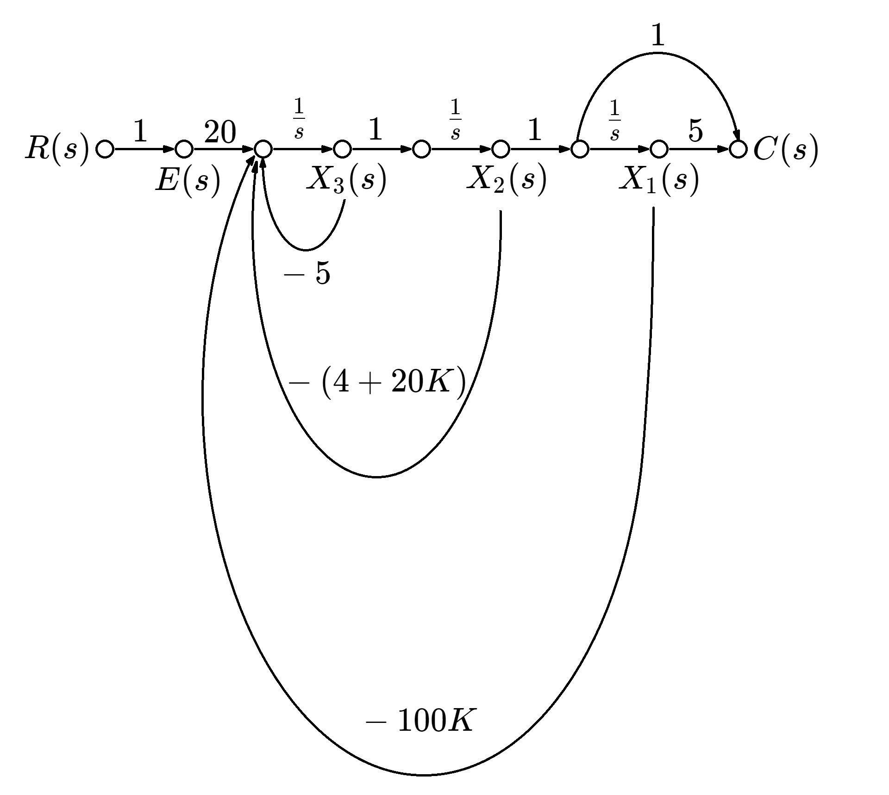

# Ch12

## 相位變數形式的控制器設計

給定一個由狀態空間改寫而成的順向***開迴路轉移函數***：  
$C(sI-A)^{-1}B+D=\frac{c_{n-1}s^{n-1}+\dots+c_1s^1+c_0}{s^n+a_{n-1}s^{n-1}+\dots+a_1s+a_0}+d$  
其中  
$A=\left [ \begin{matrix} 0&&1&&0&&\dots&&0\\0&&0&&1&&\dots&&\vdots\\\vdots&&\vdots&&\ddots&&\ddots&&1\\-a_0&&-a_1&&-a_2&&\dots&&-a_{n-1} \end{matrix} \right ]$，$B=\left [ \begin{matrix} 0\\\vdots\\0\\1 \end{matrix} \right ]$  
$C=\left [ \begin{matrix} c_0&&\dots&&\dots&&c_{n-1} \end{matrix} \right ]$，$D=d$  
則***開迴路***狀態空間為  
$$\dot{x}=Ax+Bu$$  
$$y=Cx\qquad\ \,$$  
（$r$ 才是真正的input，$u$ 是合併回授與增益後的input）  
套用回授 $u=-Kx+r$  
則得到***閉迴路***狀態空間為  
$$\dot{x}=(A-BK)x+Br$$  
$$y=Cx\qquad\qquad\qquad$$

>已知一裝置  
>$$G(s)=\frac{20(s+5)}{s(s+1)(s+4)}$$  
>設計一個相位變數回授「增益」，以產生 $\%OS=9.5$、$T_s=0.74$秒  

先得出符合規格的閉迴路極點  
極點實部$\lvert Re(pole)\rvert=\frac{4}{T_s}=\frac{4}{0.74}=5.4$  
$\zeta=-\frac{\ln{(\frac{\%OS}{100})}}{\sqrt{\pi^2+(\ln{(\frac{\%OS}{100})})^2}}$  
$\cos(\theta)=\zeta$  
用 $\theta$、$Re(pole)$求出$Im(pole)$  
找到兩個閉迴路極點為 $s=-5.41\pm 7.21j$  
此系統為三階，還有一個極點

開迴路轉閉迴路：  
$G(s)=\frac{G子}{G母}$  
閉迴路$=\frac{G}{1+KG}=\frac{G子}{G母+KG子}=\frac{20(s+5)}{s(s+1)(s+4)+K20(s+5)}$  
有一個閉迴路零點$s=-5$  
選定一個$s=-5.1$做為第三個極點使其能與零點$s=-5$大致相消  

$G(s)=\frac{20(s+5)}{s(s+1)(s+4)}=\frac{20s+100}{s^3+5s^2+4s}$  
以分母係數來寫陣列  
$A=\left [ \begin{matrix} 0&&1&&0\\0&&0&&1\\0&&-4&&-5 \end{matrix} \right ]$，$B=\left [ \begin{matrix} 0\\0\\1 \end{matrix} \right ]$

<!-- >1.
>$\frac{20(s+5)}{s(s+1)(s+4)+K20(s+5)}=\frac{20s+100}{s^3+5s^2+(4+20K)s+100K}=\frac{C(s)}{R(s)}$  
>$\Rightarrow\frac{20}{s^3+5s^2+(4+20K)s+100K}\times(s+5)=\frac{W(s)}{R(s)}\times\frac{C(s)}{W(s)}$  
>$\Rightarrow\begin{cases} (s^3+5s^2+(4+20K)s+100K)W(s)=20R(s) \\ C(s)=(s+5)W(s) \end{cases}$  
>在零初始值下反拉氏轉換  
>$\overset{...}{w}+5\ddot{w}+(4+20K)\dot{w}+100Kw=20r　　‧‧‧‧‧‧‧‧‧‧‧‧①$  
>$c=\dot{w}+5w$  
>改寫為狀態空間  
>$\begin{matrix} x_1=w \\ x_2=\dot{w} \\ x_3=\ddot{w} \end{matrix}\xrightarrow{兩邊微分}\begin{matrix} \dot{x_1}=\dot{w}=\qquad\qquad\qquad\qquad\quad\ \  \ x_2\ （取自左邊x_2=\dot{w}）\quad\, \\ \ddot{x_2}=\ddot{w}=\qquad\qquad\qquad\qquad\qquad\qquad\,\ \  x_3\,\ \ \qquad\qquad\qquad\quad \\ \overset{...}{x_3}=\overset{...}{w}=-100Kx_1-(4+20K)x_2-5x_3+20r（取自①） \end{matrix}$  
>$y=c=x_2+5x_1$  
>$\Rightarrow \left [ \begin{matrix} \dot{x_1}\\\dot{x_2}\\\dot{x_3} \end{matrix} \right ]=\left [ \begin{matrix} 0&&1&&0\\0&&0&&1\\-100K&&-(4+20K)&&-5 \end{matrix} \right ]\left [ \begin{matrix} x_1\\x_2\\x_3 \end{matrix} \right ]+\left [ \begin{matrix} 0\\0\\20 \end{matrix} \right ]r$  
>考慮到回授 $r\Rightarrow r-y = r-c$  
>$\Rightarrow \left [ \begin{matrix} \dot{x_1}\\\dot{x_2}\\\dot{x_3} \end{matrix} \right ]=\left [ \begin{matrix} 0&&1&&0\\0&&0&&1\\-100K&&-(4+20K)&&-5 \end{matrix} \right ]\left [ \begin{matrix} x_1\\x_2\\x_3 \end{matrix} \right ]+\left [ \begin{matrix} 0\\0\\20 \end{matrix} \right ](r-c)$  
>$y=\left [ \begin{matrix} 5&&1 \end{matrix} \right ]\left [ \begin{matrix} x_1\\x_2 \end{matrix} \right ]$  

>2.
>  

$20\qquad -5\qquad -100K\qquad -(4+20K)\qquad 5$ -->
